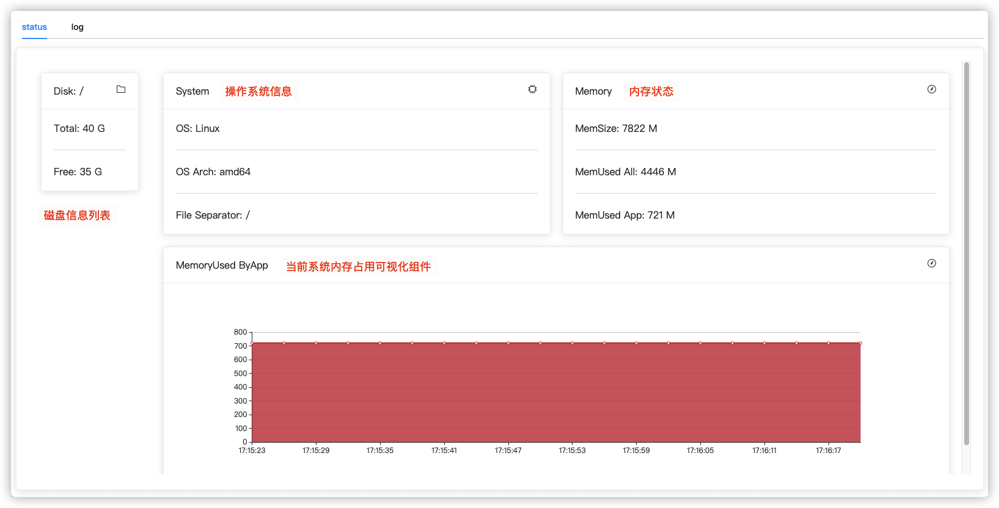
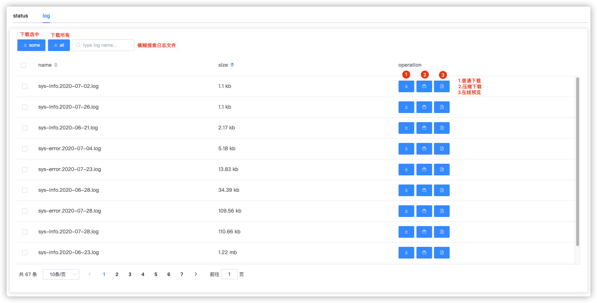
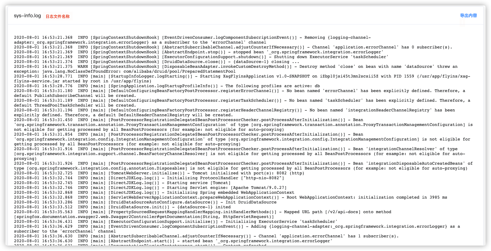
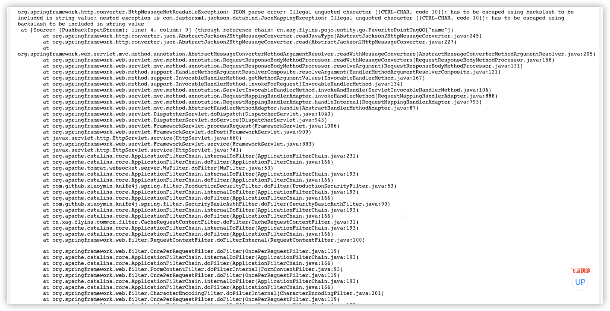

# Vmt监控插件

## 产品介绍

一个开箱即用的系统状态、系统日志监控插件，基于 Vue 3.x + SpringBoot2.x 开发，以 SpringBoot Starter 组件的方式发布，一键集成，配置简单。

### 当前功能

- 系统监控
  1. 磁盘信息
  2. 操作系统信息
  3. 内存状态
- 日志监控
  1. 日志文件检索
  2. 日志文件下载
  3. 日志内容在线监控(增量监控,全量请下载)

## 产品界面

### 系统状态监控



### 系统日志监控

#### 日志列表



#### 日志在线监控





## 用户指引

### 1.引入依赖

```xml
<dependency>
    <groupId>io.github.suopovate</groupId>
    <artifactId>vmt-spring-boot-starter</artifactId>
    <version>1.3.1-RELEASE</version>
</dependency>
```

### 2. 注解启用 Vmt

```
// openLogs 即开启日志监控 openStatus 即开启状态监控
@EnableVmt(openLogs = true,openStatus = true)
@SpringBootApplication
public class XxxxApplication {

    public static void main(String[] args) {
        SpringApplication.run(XxxxApplication.class, args);
    }

}
```

### 3. 配置application.yaml

添加以下配置到文件中

```
vmt:
  log:
    # 在线日志监控页面配置：代表每次请求从文件中拉取的日志内容(行数) 
    preview-size: 50
    # 日志文件在操作系统中的目录(绝对路径)
    dir: /usr/app/xxxx/logs
```

### 4. 访问 Vmt 主界面

```
浏览器输入：http://host:port/vmt
```

